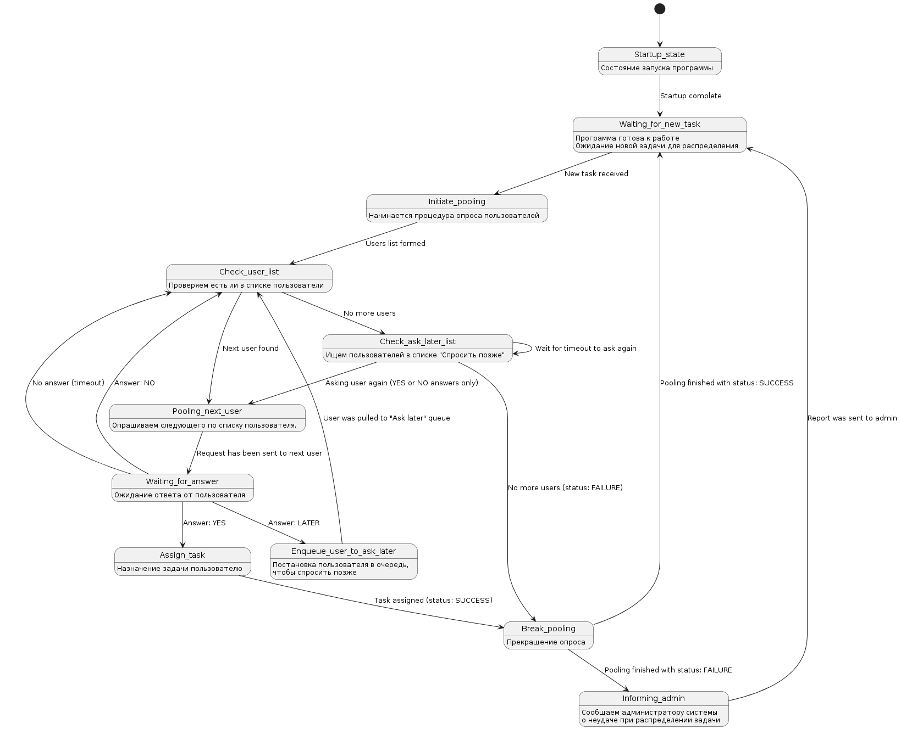

# Общее описание принципа работы приложения
## Схема работы приложения по поиску исполнителей задачи

## Функционал
- Регистрация пользователя
- Хранение информации о пользователе
- Вход пользователя в систему при помощи комбинации логин/пароль
- В зависимости от роли пользователя: создание, получение, реакция (принять, отклонить, отложить) на задачи.

## Роли (участники)
### Администратор
- **Администратор (admin)** назначает задачи, отслеживает их статус в своей панели. Администратор не может получать задачи, может только назначать новые. Получает уведомления о статусе работы с задачей приложения. В случае если приложение не смогло найти исполнителя задачи - администратор получает уведомление.
### Пользователь
- **Обычные пользователи (frontend, backend, fullstack, qa, designer)** получают уведомления о новых задачах, если в ролях задачи указана роль пользователя. Пользователь может принять, отклонить или отложить задачу. Если откладывает, то получает новое уведомление через некоторое время.
### Система распределения задач (сервер)
- **Сервер** автоматически распределяет задачи после их создания администратором. Опрашивает подходящих пользователей. В случае положительного ответа - назначает задачу пользователю. В случае отказа или отсутствия ответов - прекращает поиск исполнителя и уведомляет заказчика (администратора) о том что исполнитель не найден.

## Сущности
### Задача (Task)
Задача содержит в себе следующие свойства:
```ts
type Task = {
    id: number, //ID задачи для ее идентификации
    name: string, // Название задачи, указывается админом
    description: string, //Описание. Указывается админом.
    roles: Role[], //Подходящие для исполнения роли 1 и более
    ask_later: number[] | null, //Список пользователей, попросивших спросить их позже
    declined: number[] | null, //Список пользователей отклонивших задачу
    assigned_to: number | null, //ID пользователя, которому была назначена задача
    author_id: number, // ID автора задачи
    created_at: string, //Дата создания задачи в ISO формате
    timeout: number, //Время в миллисекундах, в течение которого необходимо распределить задачу.
    status?: TaskStatus, // Статус. Необходим для понимания, в какой раз задача отправляется пользователю на принятие или админу в качестве уведомления
    message_id?: number // ID сообщения, с которым поступила задача, для возможности реагировать отталкиваясь от сообщения.
}
```
### Пользователь (User)
Свойства пользователя:
```ts
type User = {
    id: number, //ID пользователя
    username: string, // Никнейм/логин пользователя
    role: Role, //Роль пользователя
    hashed_password: string, //Хешированный пароль для авторизации
    messages: Message[], //Сообщения пользователя
    tasks: Task[] //Задачи, принятые пользователем в работу
}
```

### Роль (Role)
Возможные варианты ролей:
```ts
type Role = 
    'frontend' | //Frontend разработчик
    'backend' | //Backend разработчик
    'fullstack' | //Fullstack разработчик
    'designer' | //Дизайнер
    'qa' | //QA Engineer
    'admin' | // Администратор
    'guest' | // Гость (незарегестрированный пользователь)
    'user'; // По умолчанию для не выбравших роль
```
Список может и должен дополняться